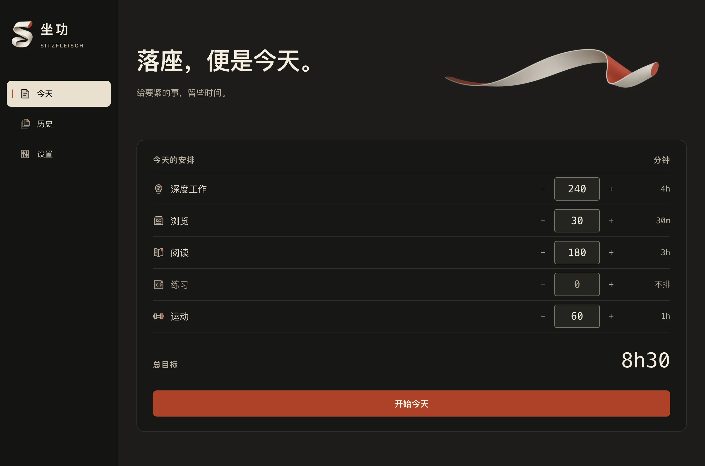
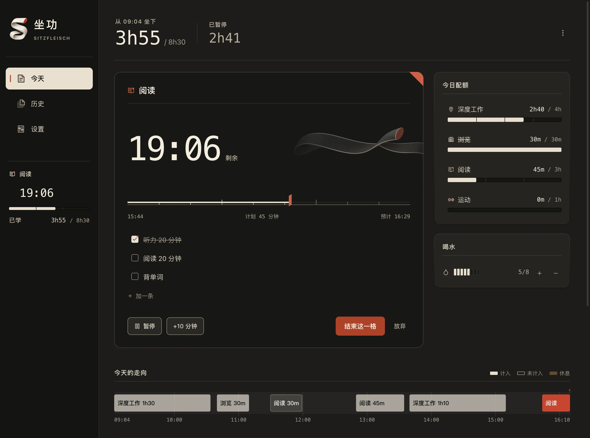
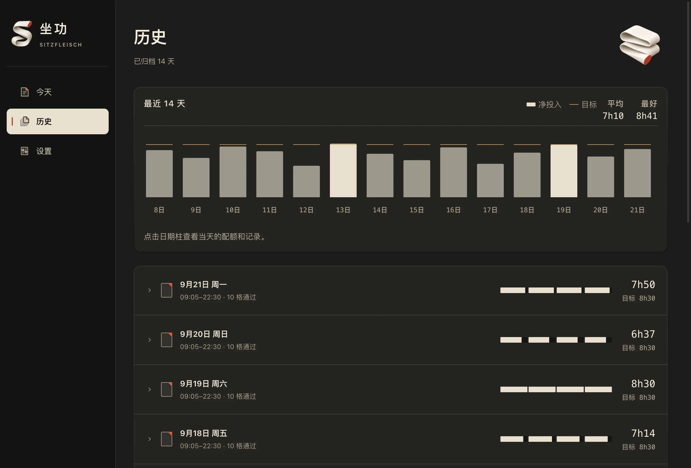

# Sitzfleisch · 坐功

一款按项目安排时间的桌面专注计时器。设定今天的目标，一段一段完成，收工后回看时间花在哪里。

**一天从「开始今天」算起，跨过午夜也不会清零。**

[下载最新版](https://github.com/snooze26h/sitzfleisch/releases/latest) · [使用说明](docs/usage.md) · [开发文档](docs/development.md)

## 从安排到收工

### 1. 安排今天

给学习、工作、阅读或运动设定目标分钟数，再按「开始今天」。项目和时长都可以自己调整。



### 2. 专注一段时间

选一个项目，开始一「格」——也就是一段专注时间。可以列待办、暂停、延长或提前结束；右侧看目标进度，下方看今天的时间轴。



### 3. 收工后回看

收工会归档当天记录。历史页展示最近 14 个已归档学习日的投入与目标，展开一天可以查看明细、复制为 Markdown。



*以上为当前界面的浏览器预览截图，使用内置演示数据。*

## 还有这些功能

- **菜单栏常驻**：关窗后继续计时，macOS 菜单栏显示倒计时、暂停和休息状态。
- **下一格建议**：根据各项目剩余目标，推荐接下来做什么。
- **网站屏蔽**：可屏蔽一个完整网址，也可屏蔽整个网站。Chrome / Edge 配套使用[浏览器扩展](browser-extension/README.md)。
- **日常提醒**：喝水计数，以及可分别关闭的喝水、起身护眼和暂停提醒。
- **本地保存**：无需注册，记录和设置保存在自己的电脑上，不上传云端。

网站屏蔽在学习日期间持续生效，暂停、休息时也不解除；收工后解除并同步。整站屏蔽需要管理员授权，精确网址屏蔽需要安装扩展。

## 下载与安装

在 [Releases](https://github.com/snooze26h/sitzfleisch/releases/latest) 选择对应安装包：

| 系统 | 安装方式 |
| --- | --- |
| macOS（Apple 芯片 / Intel） | 下载通用版 `.dmg`，将应用拖入「应用程序」。 |
| Windows（x64） | 下载 `-setup.exe`，运行安装程序。 |

macOS 版暂未做 Developer ID 签名与公证，首次打开若被系统拦截，请看[安装说明](docs/usage.md#安装)。Windows 版尚未完成真机验收。

## 本地开发

使用 Tauri 2、Rust 和 TypeScript。准备好 [开发环境](docs/development.md) 后，在仓库目录运行：

```bash
npm ci
npm run tauri dev
```

构建、测试与界面预览见[开发文档](docs/development.md)；计时规则、数据位置和已知限制见[使用说明](docs/usage.md)。

## 许可证

[MIT](LICENSE)
